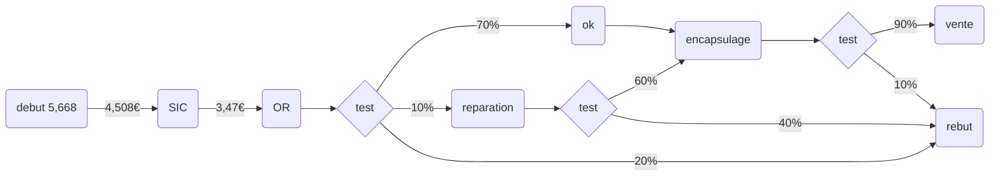

# Cours 1

## SAGE un éditeur de logiciels de gestion

1. définir l’activité de la société SAGE.

​		Mettre à disposition des entreprises des services via des site

2. qui sont les entreprise clientes de SAGE ? Pourquoi SAGE propose-t-elle des solutions différentes pour ces différentes catégories d’entreprise ? Pour ces différents secteurs d’activités ?

   ​	SAGE sert des entreprises des secteurs suivant : bâtiment, industrie, service, entreposage, commerce, garage Automobile 

3. quel langage est utiliser sur le site ?

​		Le langage reste simple et professionnel pour aider les entreprises dans leur choix

4. quelle est l’intérêt du cloud ?

​	Pas de sauvegarde, a qui on le demande.

## L’évolution structurelle de Mutabio (CM2)

La culture d’entreprise représente sont « état d’esprit »

La structure a la phase de décollage est la supervision directe.

## Question butin de paie

Quelle est le salaire brut mensuelle ?

Le salaire brut est de 1709,39€

Quelle est le salaire net mensuel ?

Le salaire net mensuel et de 1283,26€

Quelle est le montant des cotisations patronal ?

Le montant des cotisations patronal est de 767,04€

Quelle est le montant total payer par l’employeur ?

Le montant total payer par l’employer est de 20476,37€

Quelle est l’assiette retenus pour calculer les cotisations ?

Cella représente le salaire brut de 1709,39€

Expliquer pourquoi le salaire net imposable est supérieur au salaire net.

Le salaire net imposable est supérieur au salaire net car sur le salaire net les impôt sont déjà prélevé.

## 3. POURQUOI LES PRIX DES TRAINS OU DES AVIONS VARIENT D’UNE MINUTE A L’AUTRE - (IMPACTS DES SI SUR LE MARKETING)

- Quelles sont les conditions de mise en œuvre du yield management ?
  - il faut un nombre de produit limité.
  - possibilité de changer les prix
  - prix non rond
-  Quels sont les principes du yield management

# TD4

## exercice calcule de niveau

|                               |  A   |  B   |  C   |  D   |  E   |  F   |  G   |  H   |
| ----------------------------- | :--: | :--: | :--: | :--: | :--: | :--: | :--: | :--: |
| niv 0 Besoin Brut             | 100  |      |      |      |      |      |      |      |
| niv 0  Stock disponible       |  15  |      |      |      |      |      |      |      |
| niv 0 En-cours de fabrication |  0   |      |      |      |      |      |      |      |
| niv 0 En cours de commande    |  0   |      |      |      |      |      |      |      |
| niv 0 Besoin net              |  85  |      |      |      |      |      |      |      |

|                               |  A   |  B   |  C   |  D   |  E   |  F   |  G   |  H   |
| ----------------------------- | :--: | :--: | :--: | :--: | :--: | :--: | :--: | :--: |
| niv  0 Besoin Brut            |  85  |      |      |      |      |      |      |      |
| niv  1 Besoin Brut            |      | 170  | 255  |      |      |      |      |      |
| niv  1 Stock disponible       |      |  5   |  0   |      |      |      |      |      |
| niv 1 En-cours de fabrication |      |  0   |  20  |      |      |      |      |      |
| niv 1  En cours de commande   |      |  0   |  0   |      |      |      |      |      |
| niv 1 Besoin net              |      | 165  | 235  |      |      |      |      |      |

|                               |  A   |  B   |  C   |  D   |  E   |  F   |  G   |  H   |
| ----------------------------- | :--: | :--: | :--: | :--: | :--: | :--: | :--: | :--: |
| niv 1 besoin brut             |      | 165  | 235  |      |      |      |      |      |
| niv  2 Besoin Brut            |      |      |      | 660  | 330  | 235  | 235  | 470  |
| niv  2 Stock disponible       |      |      |      |  0   |  20  |  20  |  20  |  50  |
| niv 2 En-cours de fabrication |      |      |      |  20  |  0   |  0   |  0   |  0   |
| niv 2  En cours de commande   |      |      |      |  0   | 180  |  20  | 200  |  0   |
| niv 2 Besoin net              |      |      |      | 640  | 130  | 195  |  15  | 420  |

|      |  0   |  -1  |  -2  |  -3  |  -4  |  -5  |  -6  |  -7  |  -8  |  -9  | -10  | -11  | -12  | -13  | -14  |      |      |      |      |
| :--: | :--: | :--: | :--: | :--: | :--: | :--: | :--: | :--: | :--: | :--: | :--: | :--: | :--: | :--: | :--: | :--: | ---- | ---- | ---- |
|  A   |  x   |  x   |  x   |      |      |      |      |      |      |      |      |      |      |      |      |      |      |      |      |
|  B   |      |      |      |  x   |  x   |      |      |      |      |      |      |      |      |      |      |      |      |      |      |
|  C   |      |      |      |  x   |  x   |      |      |      |      |      |      |      |      |      |      |      |      |      |      |
|  D   |      |      |      |  x   |  x   |  x   |      |      |      |      |      |      |      |      |      |      |      |      |      |
|  E   |      |      |      |      |      |      |  x   |      |      |      |      |      |      |      |      |      |      |      |      |
|  F   |      |      |      |      |      |      |  x   |      |      |      |      |      |      |      |      |      |      |      |      |
|  I   |      |      |      |      |      |      |  x   |      |      |      |      |      |      |      |      |      |      |      |      |
|  J   |      |      |      |      |      |      |  x   |      |      |      |      |      |      |      |      |      |      |      |      |
|  H   |      |      |      |      |      |      |  x   |      |      |      |      |      |      |      |      |      |      |      |      |

## flexibilité peugeot

une seul ligne pour plusuer voiture, c'est a l’opérateur de choisir

