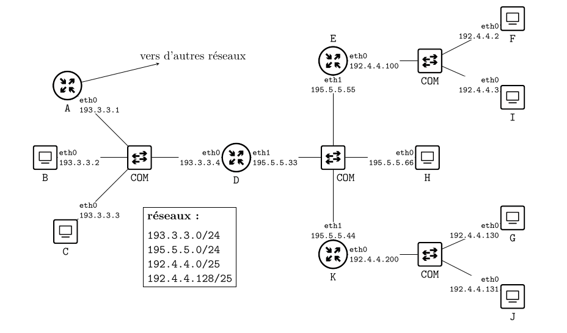
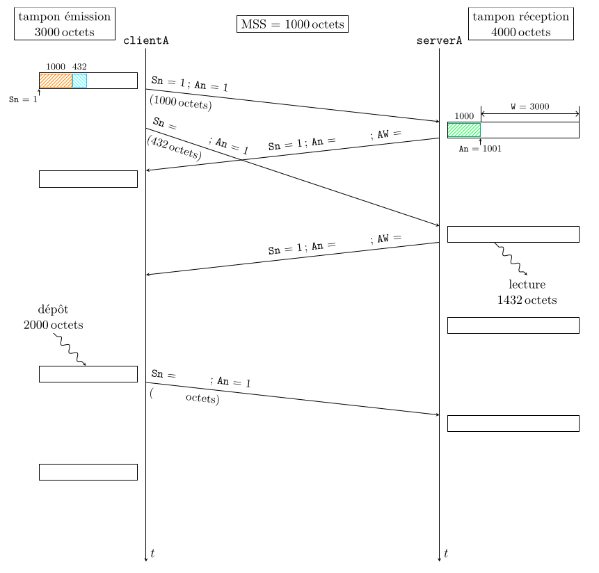

R2.04b – R2.05 – Réseaux : Travaux dirigé

voir  <https://cloud.mpqa.fr/f/170843>

# 1 Exercices sur Ethernet et Wi-Fi

## 1.1 Transmission sur un réseau Ethernet

### 1.1.1 Temps de propagation

**Question 1.1.1.1.** Donner l’expression du temps de propagation Tp d’un signal transmis  entre une station et le commutateur, en fonction de la vitesse de propagation Vp et de la longueur L entre les deux équipements.

​	1000 mb/s
$$
tp = \\frac{l(m)}{vp(m/s))}
$$
**Question 1.1.1.2.** Calculer ce temps Tp avec les données suivantes : la vitesse de propagation Vp d’un signal électrique dans un câble est de 200 000 km/s ; les deux équipements sont à 100 m l’un de l’autre. Donner cette valeur Tp en microsecondes (μs).
$$
tp = \\frac{100}{200000000}
= 0,5µs
$$

### 1.1.2 Temps d’émission

**Question 1.1.2.1.** Donner l’expression du temps d’émission Te d’une trame par une station, en fonction de la longueur de la trame (en nombre de bits noté N ) et du débit d’émission D<sub>e</sub>.
$$
te = \\frac{n(s)}{de(b/s)}
$$
**Question 1.1.2.2.** D’après la norme utilisée pour ce réseau, quel est le débit d’émission maximal Dmax<sub>e</sub> de ce réseau ?
$$
\\begin{align*}
te = \\frac{Nmax}{DEmax} \\
&= \\frac{1526*8}{1000*10⁶} \\
&= 12µs
\\end{align*}
$$
**Question 1.1.2.3.** À partir du format standard de la trame Ethernet donné en cours, calculer le temps d’émission Tmax<sub>e</sub> d’une trame de taille maximale émise par une station de ce réseau.
$$
tmax = \\frac{12208}{10^9} = 12,208µs
$$
**Question 1.1.2.4.** Quelle serait la valeur T max e si la technologie 100BASE-T était utilisée ?
$$
xtmax = \\frac{12208}{10^7} = 0,12208µs
$$

### 1.1.3 Silence inter-trame

**Question 1.1.3.1.** Le délai appelé « silence inter-trame » est nécessaire entre deux émissions (cf. cours). Quelle est l’utilité de ce délai ?

pour éviter les effet echo

**Question 1.1.3.2.** Calculer la durée Ti du silence inter-trame utilisé dans un réseau Ethernet 1000BASE-T.
$$
ti = \\frac{96}{1*10⁹} = 96ns
$$

### 1.1.4 Représentation graphique

**Question 1.1.4.1.** Représenter, sur un graphique similaire à celui ci-dessous (cf. Figure 2), tous les temps nécessaires à l’envoi de deux trames de taille maximale émises de la station A vers la station B. Les commutateurs des salles de TP de l’IUT traitent les trames en mode différé (store-and-forward) : la trame est transmise une fois reçue complètement et vérifiée

​	dommage

**Question 1.1.4.2.** Noter sur chacun de ces trois traits verticaux les événements correspon-dants à cet acheminement (envois, délais, arrivées) avec les durées associées.

​	dommage

**Question 1.1.4.3.** Reporter sur ce schéma les délais calculés dans les questions précédentes. Prendre comme temps de latence (temps de traitement de la trame par le commutateur) la va- leur Tc de 2.3 μs qui est celle indiquée dans la documentation des commutateurs HP 2530-48G des salles de TP de l’IUT.

​	dommage

**Question 1.1.4.4.** Calculer alors le temps total Ttotal nécessaire pour la transmission de ces deux trames.

​	2*TE+TP+TC+TE+TP+Tsile = 12µs + 05µs + 2,3µs + 12µs +  05µs + 9,6µs = 40,02µs

**Question 1.1.4.5.** Quels sont les temps qui peuvent être négligés dans les transmissions Ethernet 1000BASE-T ?

​	Tsilence,  TP, TE et TC sont négligeable sur assez de donnée

## 1.3 Utilisation d’une table de commutation

Soit un réseau Ethernet réalisé avec un commutateur COM_1. À l’instant d’observation du trafic, la table de commutation de ce commutateur COM_1 est reportée dans le Tableau 1.

**Question 1.3.1.** La trame d’adresse source 00:16:01:66:bb:33 et d’adresse destination 00:0e:0c:64:6b:7d arrive au commutateur COM_1 par son port P5. Comment le commutateur retransmet-il cette trame et comment met-il à jour sa table de commutation ?

​	il l’enverra vers P3

​	dans un reseau lan l'adresse 00:16:01:66:bb:33 et ajouter a la table comme étant sur le port P5

**Question 1.3.2.** La trame d’adresse source 00:0e:0c:60:1b:88 et d’adresse destination 00:18:8b:44:66:54 arrive au commutateur COM_1 par son port P2. Comment le commutateur e transmet-il cette trame et comment met-il à jour sa table de commutation ?

il l'envoie a tout le monde

**Question 1.3.3.** La trame d’adresse source 00:0e:0c:58:9c:20 et d’adresse destination 00:18:8b:d5:8d:39 arrive au commutateur COM_1 par son port P2. Comment le commutateur retransmet-il cette trame et comment met-il à jour sa table de commutation ?

il ajoute 00:0e:0c:58:9c:20 a la table pour P2

**Question 1.3.4.** La trame d’adresse source 00:0e:0c:64:6b:7d et d’adresse destination ff:ff:ff:ff:ff:ff arrive au commutateur COM_1 par son port P6. Comment le commutateur retransmet-il cette trame et comment met-il à jour sa table de commutation ?

il remplace P3 par P6

il envoie a tout le monde

**Question 1.3.5.** Représenter la topologie du réseau Ethernet (ensemble des stations, com-mutateur(s) et câbles de connexion) telle qu’on peut la déduire de la table de ce commutateur et de l’ensemble des échanges ci-dessus. On représentera la topologie la plus simple qui permette d’observer la table de commutation de COM_1.

**Question 1.3.6.** En supposant que ce réseau Ethernet ne change pas (pas de nouvelle station ni de commutateur, aucun déplacement des équipements), est-il possible que la trame d’adresse source 00:16:76:d1:6f:e9 et d’adresse destination 00:0e:0c:60:1b:88 arrive au commutateur COM_1 par son port P2 ? Justifier votre réponse.

non car il sont sur le même commutateur qui doit gérer lui même.

## 1.4 Mise à jour d’une table de commutation

L’objectif de cet exercice est d’analyser le comportement et la mise à jour de la table d’un commutateur Ethernet en fonction des événements qui lui arrivent (en l’occurrence des trames qui arrivent sur ses ports).
Les hypothèses et le scénario observés sont les suivants :

- Initialement, la table de commutation du commutateur est vide.
- Sept trames arrivent dans l’ordre indiqué dans le Tableau 2. Pour chaque trame sont indiqués le port d’entrée dans le commutateur ainsi que les adresses Ethernet destination et source

| ordre | port d’entrée | adresse destination | adresse source    |
|-------|---------------|---------------------|-------------------|
| 1     | P1            | ff:ff:ff:ff:ff:ff   | 01:02:03:ab:ee:22 |
| 2     | P3            | 01:02:03:ab:ee:22   | 01:02:03:ab:ee:11 |
| 3     | P2            | ff:ff:ff:ff:ff:ff   | 01:02:03:ab:ee:66 |
| 4     | P2            | 01:02:03:ab:ee:11   | 01:02:03:ab:ee:66 |
| 5     | P3            | 01:02:03:ab:ee:99   | 01:02:03:ab:ee:55 |
| 6     | P4            | ff:ff:ff:ff:ff:ff   | 01:02:03:ab:ee:77 |
| 7     | P3            | 01:02:03:ab:ee:22   | 01:02:03:ab:ee:33 |

**Question 1.4.1.** Que fait le commutateur lorsqu’il reçoit la trame n°1 ? Justifier.

il envoie a tout le monde et met a jour P1

**Question 1.4.2.** Que fait le commutateur lorsqu’il reçoit la trame n°2 ? Justifier.

il envoie a P1 et il met a jour la table

**Question 1.4.3.** Quelle information peut-on déduire de l’analyse de l’ensemble des trames arrivant sur le port P3 ? Expliquer quel(s) équipement(s) permet(tent) d’arriver à cette situation.

il y a un/des commutateur derrière P3

**Question 1.4.4.** Représenter ce réseau Ethernet tel que l’on peut le déduire de cette séquence de trames reçues. Y faire apparaître les stations, le(s) commutateur(s) et les câbles de connexion.

**Question 1.4.5.** Donner la table de commutation de ce commutateur à l’issue de la réception et du traitement de ces sept trames.
**Question 1.4.6.** La trame d’adresse source 01:02:03:ab:ee:99 et d’adresse destination 01:02:03:ab:ee:22 arrive au commutateur par son port P6. Décrire ce que fait le commutateur.
**Question 1.4.7.** La trame d’adresse source 01:02:03:ab:ee:77 et d’adresse destination 01:02:03:ab:ee:bb arrive au commutateur par son port P4. Décrire ce que fait le commutateur.

# 2 Exercices sur l’adressage IP

## 2.1 Adressage IPv4

Pour cet exercice, il est recommandé de se rappeler quelques éléments du codage binaire
non signé, comme :
— (1000_0000)2 = 27 = 128,
— (0100_0000)2 = 26 = 64,
— (0010_0000)2 = 25 = 32,
— (1111_1111)2 = 28 − 1 = 255.

### 2.1.1 Adressage IP en CIDR /24

Considérons le réseau IP d’adresse CIDR 192.100.56.0/24.

**Question 2.1.1.1.** Quel est l’intervalle des adresses possibles de ce réseau ? Donner cet intervalle en binaire et en notation décimale pointée.

- 192.100.56.0/24 -> 1100 0000.0110 0100.0001 1100
- la première machine se trouve en 192.100.56.1 -> 1100 0000.0110 0100.0001 1101
- la dernière peut être 1100 0000.0110 0100.1111 1110

**Question 2.1.1.2.** Quel est le masque de réseau ? Donner ce masque en binaire et en notation décimale pointée.

- masque: 11111111 11111111 11111111 00000000 -> 255 255 255 0

**Question 2.1.1.3.** Quelle est l’adresse de diffusion de ce réseau ?

- adresse de diffusion: 1100 0000.0110 0100.1111 1111

**Question 2.1.1.4.** Combien de machines au maximum peut-on connecter sur ce réseau ?

- 126 car 128-2

**Question 2.1.1.5.**

- la première machine ne change pas.
- la dernière machine vaut 1100 0000.0110 0100.0111 1110 -> 254-128 =126
- masque sous réseau: 11111111 11111111 11111111 10000000 -> 255 255 255 128
- diffusion: 1100 0000.0110 0100.0111 1111

### 2.1.3 Détermination des réseaux auxquels appartient une machine

Soit une machine sur laquelle la commande ip addr donne (entre autres) la réponse
suivante :

```
eth0: <BROADCAST,MULTICAST,UP,LOWER_UP> mtu 1500
	link/ether 28:80:23:0b:c8:33 brd ff:ff:ff:ff:ff:ff
	inet 192.1.131.13/24 brd 192.1.131.255
wlan0: <BROADCAST,MULTICAST,UP,LOWER_UP> mtu 1500
	link/ether e8:b1:fc:55:2c:f1 brd ff:ff:ff:ff:ff:ff
	inet 192.168.16.255/23 brd 192.168.17.255
```

**Question 2.1.3.1.** Donner en notation CIDR, l’adresse des réseaux IP auxquels cette machine appartient.

- eth0: 192.1.131.0/24
- wlan0: 192.168.16.0/23

**Question 2.1.3.2.** Pour chacun des réseaux, indiquer le nombre maximum de machines qu’il peut avoir.

- eth0: 2³²⁻²⁴⁼⁸ = 254
- wlan0: 2⁹ = 510

**Question 2.1.3.3.** Quelle est l’adresse de diffusion du deuxième réseau (la machine y est connectée par l’interface wlan0) ?

- les deux sont active car les deux sont *up*

### 2.1.4 Révision sur l’adressage IP

**Question 2.1.4.1.** Compléter le tableau.

|                                                                                                                                                                                                           | réseau IP n°1                                                                       | réseau IP n°2                                                                                                      |
|-----------------------------------------------------------------------------------------------------------------------------------------------------------------------------------------------------------|-------------------------------------------------------------------------------------|--------------------------------------------------------------------------------------------------------------------|
| adresse de réseau en notation CIDR<br />adresse de réseau<br />masque de réseau<br />adresse de diffusion<br />nombre de stations possible dans le réseau<br />192.168.2.193 dans le réseau ? (justifier) | 192.168.2.128/26<br />192.168.2.128<br />255.255.255.192<br />192.168.2.191<br />62 | 192.168.2.128<br />192.168.2.128<br />255.255.255.128<br />192.168.2.255<br />126 machine<br />oui car 128<193<255 |

## 2.2 Adressage IPv6

La version actuelle du protocole IP (IPv4) utilise des adresses codées sur 4 octets, ce qui limite à 232 (environ 4.3×109 ) le nombre d’adresses différentes. Le successeur d’IPv4, à savoir le protocole IPv6, est actuellement en cours de déploiement sur Internet. Il utilise des adresses sur 128 bit, notées en hexadécimal.

### 2.2.1 RENATER

Le bloc 2001:6600:0000:0000:0000:0000:0000:0000/32 est, avec la notation CIDR, le
bloc d’adresses IPv6 attribué à RENATER.

*AttentionL’adresse (2001:6600:0000:0000:0000:0000:0000:0000) est notée en hexadécimaltandis que la taille du préfixe (/32) est notée en décimal.Remarque. En notation abrégée 2 , ce bloc d’adresse se note 2001:6600::/32.*

**Question 2.2.1.1.** Combien d’adresses différentes RENATER peut-il utiliser ? Donner le nombre d’adresses en puissance de 2.

2⁹⁶ machines

**Question 2.2.1.2.** Donner l’intervalle d’adresses du bloc de RENATER avec la notation IPv6 (en hexadécimal).

2001.6000.FFFF...FFFF

### 2.2.2 Free

Depuis décembre 2007, le fournisseur d’accès à Internet (FAI) Free permet à ses abonnés un accès en IPv6. Avec ce mode d’accès, chaque abonné se voit attribuer un bloc d’adresses de la forme suivante (en notation CIDR) : 2a01:0e35:2f22:e3d0:0000:0000:0000:0000/64.

Remarque. En notation abrégée, le bloc se note 2a01:e35:2f22:e3d0::/64.

**Question 2.2.2.1.** Combien d’adresses IPv6 différentes un abonné de Free peut-il utiliser ?
Donner le nombre d’adresses en puissance de 2.

**Question 2.2.2.2.** Donner l’intervalle d’adresses utilisables avec la notation IPv6 (en hexa-
décimal).

## 2.3 Allocation d’un sous-réseau IPv4

### 2.3.1 Allocation d’un sous-réseau IPv4

Nous supposons qu’un fournisseur d’accès Internet (FAI) a reçu pour exercer son activité le bloc d’adresses CIDR 202.0.64.0/18 avec lequel il a constitué son réseau. Comme tout prestataire, il est libre de découper son espace d’adresses comme il l’entend pour fournir des adresses à ses clients. La société MaBouate, cliente de ce FAI, lui demande un espace suffisant pour 1022 machines au maximum. On cherche quel intervalle d’adresses le FAI allouera au client MaBouate, sachant qu’au moment de la demande la première adresse réseau qui est libre est 202.0.96.0.

**Question 2.3.1.1.** Déterminer d’abord le nombre de bits minimum nécessaires pour la partie « machine » des adresses du réseau MaBouate.

- il faudra 2¹⁰ soit 1024 machine donc 10bits

**Question 2.3.1.2.** Donner le masque correspondant en binaire puis en notation décimale pointée.

- 11111111 11111111 11111100 00000000

**Question 2.3.1.3.** Représenter en binaire puis en notation décimale pointée l’intervalle des adresses allouées.

- 1ere adresse: 11111111 11111111 01100000 00000001
- derniere adresse 11111111 11111111 01100011 11111110

**Question 2.3.1.4.** Donner en notation CIDR l’adresse du réseau alloué à ce client.

- 202.0.96.0.22

### 2.3.2 Adressage et sous-réseau IP

Soit un réseau d’adresse 194.129.32.0/23.
**Question 2.3.2.1.** Combien de machines ce réseau permet-il d’adresser ? Justifier.

- 32-23 = 9, 2⁹ = 512 donc le réseau peut adresser 510 machines

**Question 2.3.2.2.** Quelle est l’adresse de diffusion de ce réseau ? L’administrateur de ce réseau 194.129.32.0/23 souhaite le découper en quatre sous-réseaux de taille maximale et de taille égale.

- 194.129.32.255 = 1100 0010.1000 0001.0010 0001.1111 1111

**Question 2.3.2.3.** Compléter le tableau ci-dessous.
Conseil : avant de remplir ce tableau, écrire en notation binaire la partie d’adresse utile pour faire ce découpage (le dernier octet de poids faible), puis convertir la valeur trouvée en décimal. Ne pas utiliser l’hexadécimal !

| sous-réseau n° | adresse réseau (CIDR) | masque          | adresse diffusion | nombre max. de stations |
|----------------|-----------------------|-----------------|-------------------|-------------------------|
| 1              | 194.129.32.0/25       | 255.255.255.128 | 194.129.32.127    | 126                     |
| 2              | 194.129.32.128/25     | 255.255.255.128 | 194.129.32.255    | 126                     |
| 3              | 194.129.33.0/25       | 255.255.255.128 | 194.129.33.127    | 126                     |
| 4              | 194.129.33.128/25     | 255.255.255.128 | 194.129.33.255    | 126                     |

**Question 2.3.2.4.** À quel sous-réseau appartient l’adresse 194.129.33.188 ? Donner la méthode de calcul qu’utiliserait un routeur.

- 33.128

**Question 2.3.2.5.** À quel sous-réseau appartient l’adresse 194.129.32.214 ? Donner la méthode de calcul qu’utiliserait un routeur.

- 32.128

# 3Exercices sur le routage IP

## 3.1 Routage dans l’inter-réseau de l’exemple du cours

On considère l’exemple de réseau dont le schéma est donné ci après (cf. Figure 4).



**Question 3.1.1.** Terminer la définition des tables de routage nécessaires au bon fonctionnement de cet inter-réseau : toute station doit pouvoir communiquer avec toutes les autres et doit pouvoir accéder aux autres réseaux. Pour cela, définir les tables de routage des stations E et K.

station E:

| dest      | gatway     | netmask           | interface |
|-----------|------------|-------------------|-----------|
| 192.4.4.0 | \-          | 255.255.255.128   | eth0      |
| 193.3.3.0 | 195.5.5.44 | 255.255.255.128   | eth1      |
| 195.5.5.0 | 0.0.0.0    | 255.255.255.255.0 | eth1      |
| 0.0.0.0   | 195.5.5.53 | 0.0.0.0           | eth1      |

station K:

| dest        | gatway     | netmask         | interface |
|-------------|------------|-----------------|-----------|
| 192.4.4.0   | 192.5.5.55 | 255.255.255.128 | eth1      |
| 192.4.4.128 | 0.0.0.0    | 255.255.255.128 | eth0      |
| 105.5.5.0   | 0.0.0.0    | 255.255.255.0   | eth1      |
| 193.3.3.0   | 195.5.5.33 | 255.255.255.0   | eth1      |
| 0.0.0.0     | 195.5.5.33 | 0.0.0.0         | eth1      |

station A

| dest      | gatway    | netmask       | interface |
|-----------|-----------|---------------|-----------|
| 192.4.4.0 | 193.3.3.4 | 255.255.255.0 | eth0      |
| 193.3.3.0 | 0.0.0.0   | 255.255.255.0 | eth0      |
| 195.5.5.0 | 193.3.3.4 | 255.255.255.0 | eth0      |
| 0.0.0.0   | vers ?    | 0.0.0.0       | ?         |

**Question 3.1.2.** Décrire comment le routage s’applique pour différents cas d’acheminement  de paquets. L’objectif est de comprendre comment les tables sont utilisées et comment les trames sont constituées pour transporter les paquets IP d’un équipement à l’autre (quelles sont leurs adresses MAC source et destination).

1. Indiquer, pour l’acheminement d’un paquet de D vers H :

   | trame n° | @MAC source   | @MAC destination | @IP source  | @IP destination |
   |----------|---------------|------------------|-------------|-----------------|
   | D->H     | @mac -d/eth1  | @mac -H eth0     | 195.5.5.33  | 195.5.5.66      |
   | G->K     | @mac -g/eth0  | @mac -K /eth0    | 192.4.4.130 | 192.4.4.2       |
   | K->E     | @mac -K /eth1 | @mac -E /eth1    | 192.4.4.130 | 192.4.4.2       |
   | E->F     | @mac -E/ eth0 | @mac -F/eth0     | 192.4.4.130 | 192.4.4.2       |

- Quelle règle de la table de routage s’applique dans le premier routeur traversé.
- Le nombre de trames nécessaires, et pour chaque trame, les adresses MAC source et destination. Pour noter les adresses MAC, mettre une identification littérale, par exemple « @MAC-D/eth0 » (celle correspondant à sa carte réseau sur 193.3.3.0). On ne précisera l’interface que pour les routeurs.

2\. Reprendre les questions précédentes pour l’acheminement d’un paquet de G vers F.

## 3.2 Routage IP dans un inter-réseau d’entreprise

Soit un inter-réseau d’entreprise schématisé par la Figure 5. Pour simplifier, on ne fait pas apparaître les commutateurs ou autres équipements de niveau physique/liaison. Les adresses Ethernet et IP des stations qui ne sont pas données pourront être écrites sous la forme @MAC-Si et @IP-Si, où Si est une station. Seules les adresses IP des routeurs R1 et R2 sont données avec le nom de l’interface associée à l’adresse IP. Attention, le réseau est isolé du reste du monde  (déconnecté d’Internet).


**Question 3.2.1.** Proposer une table de routage pour la station S4.

| dest        | gatway      | netmask         | interface |
|-------------|-------------|-----------------|-----------|
| 192.1.1.0   | 192.1.1.230 | 255.255.255.0   | eth0      |
| 192.6.6.128 | 0.0.0.0     | 255.255.255.128 | eth0      |
| 192.1.1.0   | 112.6.6.200 | 255.255.255.0   | eth0      |

**Question 3.2.2.** Proposer une table de routage pour les routeurs R1 et R2 de telle sorte
que toutes les stations puissent communiquer entre elles. Faire apparaître les quatre colonnes
vues en cours.

Question 3.2.3. Un paquet IP est émis par la station S4 à destination de la station S6.

1. Quelles sont les adresses IP source et destination du paquet émis par S4 ?

   on ne connais pas mais celle de S4 et S6
2. Combien de trames seront nécessaires pour acheminer ce paquet ? Justifier et donner la/les trames nécessaires.
3. Expliquer comment la station S4 obtiendra les adresses MAC nécessaires pour former la trame contenant ce paquet. Indiquer à quelles machines correspondent les adresses MAC de cette trame.

   avec ARP
4. Quelle sera la valeur des adresses IP source et IP destination, MAC source et MAC destination du paquet IP qui sera reçu par la station S6 ?

   @ip s4, @ipS6 @mac R2, @mac R1

# 4 Protocole TCP

## 4.1 Schéma d’échange à compléter

Dans cet échange (cf. Figure 7) similaire à ceux vus en cours, renseigner les valeurs champs An, Sn, AW et représenter l’état des tampons émission (avec Sn) et réception (avec An et W). À partir du dépôt des 2000 octets par l’application côté clientA, représenter tous les échanges jusqu’à acquittement complet.



an = 1001 aw = 3000 (4000-1000)

an = 1433, aw = 4000

## 4.2 Phase d’ouverture d’une connexion TCP

Soit une application cliente souhaitant établir une connexion TCP avec une application serveur, en attente sur le numéro de port 8888. On suppose que le système du client attribue le numéro de port 12345 pour cette connexion. On suppose que les tampons émission et réception des programmes TCP ont une capacité de 4000 octets chacun.

\

port source= 12345

port destination = 8888

numéro de séquence = 1

numéro d'acquittement 1

head len = 24

flag = syn

fenêtre 4000

**Question 4.2.2.** Que signifie l’acronyme MSS ? À quoi sert cette valeur ?

- maximum sequance size

**Question 4.2.3.** Quelles sont les trois grandes phases d’échanges au cours d’une connexion TCP ?

1. synchronisation
2. le transport
3. la fermeture

**Question 4.2.4.** Quel drapeau (flag) est caractéristique de la phase d’ouverture de connexion ?

- sync: ouverture

Quel drapeau est caractéristique de la phase de fermeture de connexion ?

- fin: fermeture

## 4.4 Paramètres à l’ouverture d’une connexion TCP

Soit une application cliente, située sur une machine d’adresse IP 191.11.11.11 qui souhaite établir une connexion TCP avec une application serveur située sur une machine d’adresse IP 192.12.12.12 et en attente sur le numéro de port 8765. On suppose que le système du client attribue le numéro de port 12345 pour cette connexion. Les deux machines sont chacune situées sur un réseau local Ethernet. Les tampons émission et réception des programme TCP sont de 50 ko chacun.
**Question 4.4.1.** Donnez la valeur des différents champs de l’en-tête du premier segment TCP envoyé pour demander l’ouverture de cette connexion.
**Question 4.4.2.** Représentez sur la Figure 8 ci-dessus le diagramme d’échange de l’ouverture de cette connexion TCP.
**Question 4.4.3.** Représentez sur la Figure 8 le délai RTT déterminé par le client et celui déterminé par le serveur. Quel paramètre de la connexion sera mis à jour grâce à ce délai RTT ?
**Question 4.4.4.** À l’issue de cette phase d’ouverture, quelle valeur de MSS sera utilisée par les programmes TCP côté client et côté serveur ?
**Question 4.4.5.** Représenter l’état des tampons émission et réception de chaque côté de cette connexion à l’issue de cette phase d’ouverture.

# 5. Applications et encapsulation

## 5.2 Analyse d’une trame

**Question 5.2.1.** On considère la trace wireshark de la figure 10.

1. Donnez l’adresse MAC, IP et le port du client et du serveur. Attention, une de ces informations n’est en fait pas accessible. Indiquez laquelle et justifiez votre réponse.
2. Donnez la définition des éléments Seq=,Ack=, Win= et Len=.
3. Nommez les trois phases d’une connexion TCP et associez les numéros de trames qui correpondent en face de ces noms
4. Repérez les deux segments TCP qui transportent des messages HTTP. Pour la réponse HTTP (trame 60), donnez la taille du message HTTP transmis en nombre octets. Comment avez-vous procédé pour trouver ce nombre ?
5. Sur le diagramme d’échange suivant, complétez les échanges TCP à partir de la trame 60 (réponse HTTP) jusqu’à la trame 65 en considérant que la trame 62 initie la terminaison de la connexion. Vous représenterez les drapeaux, les numéros de Sn, An, la fenêtre de réception ainsi que le nombre d’octets transmis. On considérera que les tampons ne sont jamais vidés par l’application et on ne les représentera pas sur le diagramme.

# 6. Exercice sur les VLANs

## 6.1 Inter-réseau constitué de trois VLANs

Soit un inter-réseau réalisé avec un commutateur/routeur, représenté sur le schéma ci- dessous (cf. Figure 12).


Ce commutateur/routeur relie trois réseaux virtuels (VLAN) : 194.199.20.0/25, 192.168.0.0/24 et 192.168.1.0/24. Comme on le voit sur la Figure 12, la constitution de ces VLAN est faite Ce  commutateur/routeur relie trois réseaux virtuels (VLAN) : 194.199.20.0/25, 192.168.0.0/24  
et 192.168.1.0/24. Comme on le voit sur la Figure 12, la constitution de ces VLAN est faite statiquement. Les adresses du commutateur/routeur sont les suivantes:

- 194.199.20.1 sur le réseau 194.199.20.0.  
  L’interface associée à cette adresse IP a pour adresse MAC a0:..:b0.
- 192.168.0.1 sur le réseau 192.168.0.0.  
  L’interface associée à cette adresse IP a pour adresse MAC a0:..:b1.
- 192.168.1.1 sur le réseau 192.168.1.0.  
  L’interface associée à cette adresse IP a pour adresse MAC a0:..:b2.

**Question 6.1.1.** La station Z envoie une trame Ethernet en diffusion (adresse destination  
ff:ff:ff:ff:ff:ff). Quelles stations recevront cette trame ?

​	seul F, Z et E

**Question 6.1.2.** Donner la table de routage de la station Y (deux lignes suffisent).

​

|     dest     |   gateway    |     genMask     | iface  |
|:------------:|:------------:|:---------------:|:------:|
| 194.199.20.0 |   0.0.0.0    | 255.255.255.128 | eth... |
|   0.0.0.0    | 194.199.20.1 |     0.0.0.0     | eth... |

**Question 6.1.3.** Donner la table de routage du commutateur/routeur.

|     dest     | gateway |     genMask     | iface  |
|:------------:|:-------:|:---------------:|:------:|
| 192.168.20.0 | 0.0.0.0 | 255.255.255.118 | vlan 2 |
| 192.168.0.0  | 0.0.0.0 |  255.255.255.0  | vlan 1 |
|  192.168.1   | 0.0.0.0 |  255.255.255.0  | vlan 3 |

**Question 6.1.4.** Donner la table de commutation du commutateur/routeur.

| destination | port |
|:-----------:|:----:|
|     @a      |  P1  |
|     @x      |  P2  |
|     @y      |  P2  |
|     @z      |  P3  |
|     @b      |  P4  |
|     @c      |  P4  |

**Question 6.1.5.** La station Y envoie un paquet IP à la station A.

1. Expliquer précisément ce qui est exécuté dans la station Y pour permettre l’envoi du paquet.
   1. il va pouvoir faire directement la requete car A et Y sont dans le même reseau
2. Quelle adresse MAC destination contiendra la trame qui contient le paquet émis par Y ? Justifier votre réponse.

   l'adresse mac de A
3. Le commutateur/routeur fonctionne-t-il en tant que commutateur ou en tant que routeur ? Décrire ce qu’il fait pour acheminer ce paquet.

   il fonctionne en tant que routeur car il ne connais pas les adresse de tout le monde

   il fonctionne en tant que commutateur dans le même vlan

## 6.2 Transformation d’une installation Ethernet

Les administrateurs de l’inter-réseau dont le schéma est donné ci-dessous (cf. Figure 13) ont souhaité faire évoluer leur installation. Ils ont donc remplacé les commutateurs COM_1 et COM_2 ainsi que le routeur R1 par un unique équipement de type « commutateur/routeur » et appelé COM/ROUT.


**Question 6.2.1.1.** Quel est l’intérêt pour les administrateurs de cet inter-réseau d’effectuer
ce changement ?

- moins cher à entretenir

**Question 6.2.1.3.** Combien de réseaux Ethernet a-t-on dans cet inter-réseau ? Justifier.

- 3

**Question 6.2.1.4.** Combien de réseaux IP a-t-on dans cet inter-réseau ? Justifier.

- 3 autant que des eth

**Question 6.2.2.1.** Donner la table de routage de la station A.

|    dest    |  gateway   |    genMask    | iface  |
|:----------:|:----------:|:-------------:|:------:|
| 144.19.2.0 |  0.0.0.0   | 255.255.255.0 | eth... |
|  0.0.0.0   | 144.19.2.1 | 255.255.255.0 | eth... |

**Question 6.2.2.2.** Lister les machines dont les adresses IP/MAC peuvent apparaître dans
le cache ARP de A.

- tout son réseau direct

**Question 6.2.2.3.** Donner la table de commutation complète de COM/ROUT.
**Question 6.2.2.4.** Donner la table de routage de COM/ROUT.