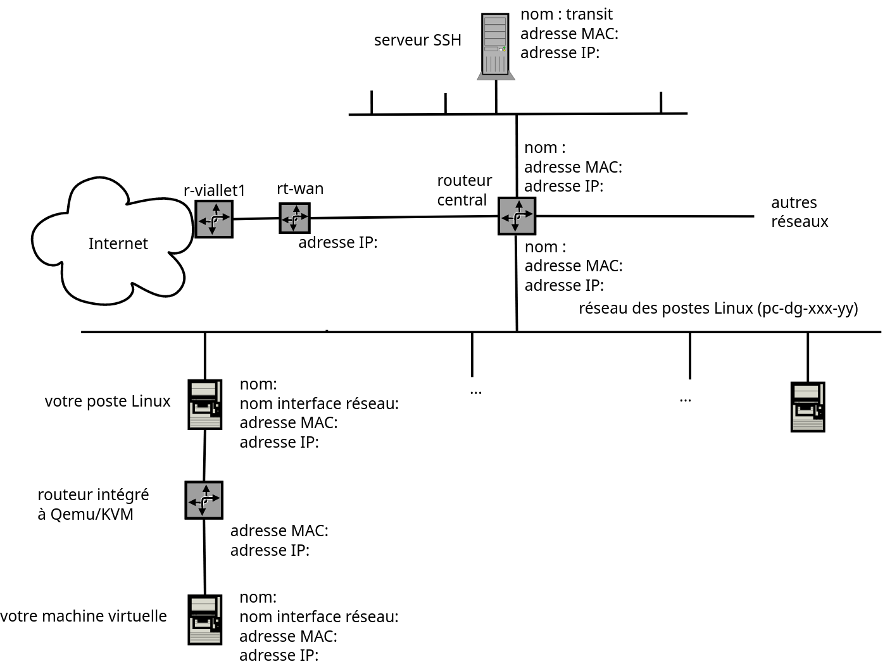

# TP7 : Routage IP

---

Ce TP a pour objectif de comprendre comment le routage IP s'effectue dans les réseaux de l'IUT2 ainsi que dans les réseaux accessibles. Le schéma ci-dessous représente les réseaux et routeurs de l'IUT2. Il peut être complété partiellement à partir des questions des TP précédents et sera à compléter au fur et à mesure des questions de ce TP.

---



## 1\. Réseaux du schéma et adresses des machines

En observant le schéma et en utilisant les commandes réseaux déjà vues (ip addr, ip neigh, ...) : 

1. Combien de réseaux IP peut-on identifier ? Entourer ces réseaux et écrire sur le schéma l'adresse de chacun.

   rt-wan: 193.55.51.1

   poste linux: 193.55.51.227, mac: e4:54:e8:59:61:14, nom interface: eth0

   transit 00:50:56:ab:ff:01: 193.55.51.227

   machine virtuelle: nom eth0, adress mac: 52:54:00:12:34:56, ip: 10.0.2.15

   routeur qEmu: 10.0.2.2 
2. Écrire sur le schéma les informations de votre machine virtuelle et du routeur intégré à Qemu/KVM (cf. TP06).
3. Écrire sur le schéma les informations de votre poste Linux.
4. Écrire sur le schéma les informations de "`transit`" (se connecter à transit pour obtenir les adresses de cette machine).

## 2\. Tables de routage

La **table de routage** de chaque machine contient les informations nécessaires au routage des paquets IP (choix du chemin en fonction de l'adresse destination). Les commandes ip route et netstat -rn donnent la table de routage et renseignent donc sur les réseaux accessibles et sur les passerelles (*gateway* ou routeurs) qui vont prendre en charge le routage des paquets. On rappelle que les adresses MAC peuvent être obtenues à partir des adresses IP par la commande ip neigh. 

1. Quel est le réseau accessible directement sans passerelle depuis votre poste Linux (donner son adresse CIDR) ?

   192\.168.141.0/24
2. Pour aller de votre poste Linux vers une machine quelconque d'un autre réseau, par quelle machine les paquets sont-ils routés ? Écrire son nom, son adresse IP et son adresse MAC dans le schéma de réseau ci-dessus.

   on passera par 192.168.141.0
3. Pour aller de la machine `transit` vers une machine quelconque d'un autre réseau, par quelle machine les paquets sont-ils routés ? Compléter le schéma ci-dessus.

on passera par 192.168.141.0

## 3\. Routage dans le réseau de l'IUT2

Comme vu au TP02, la commande ping NOM_MACHINE indique si la machine distante est accessible ou non. Pour cela, un paquet IP (de type ICMP Echo Request) est envoyé à la machine distante et un paquet IP (de type ICMP Echo Reply) est renvoyé en réponse (ou pas !). 

La commande traceroute ou traceroute -I utilise une succession de paquets ICMP avec des TTL de valeurs croissantes pour afficher le(s) routeur(s) emprunté(s) par les paquets IP pour aller sur une machine distante.  

Utiliser cette commande pour trouver les 2 adresses IP du routeur central du schéma précédent et remplir le tableau :  

| Adresses source et destination du paquet IP | Adresse IP du routeur |
|---------------------------------------------|-----------------------|
| pc-dg-xxx-yy -> transit                     | 192\.168.141.0         |
| transit -> pc-dg-xxx-yy                     | 192\.168.141.0         |

 Quelles adresses IP notées précédemment retrouve-t-on ?

celles de routeur central

## 4\. Routages multiples

### 4\.1 Logiciel traceroute

Pour toutes les destinations du tableau ci-dessous, observer le chemin emprunté et le délai d'aller-retour (RTT), en utilisant la commande suivante : 

```
traceroute -q1 NOM_DESTINATION
```

 

Si la route n'est pas affichée de façon complète, lancer la commande plusieurs fois de suite.  

Pour les villes traversées, vous pourrez vous aider de cette [carte de "Internet2"](https://storage.pardot.com/66332/164745521835nC3kYg/NS_map_march22.png).  

| Destination                                                     | Nombre de  
routeurs      | Nom des villes ou lieux traversés  
(si visibles dans la trace)      | Valeur approximative du dernier RTT |
|-----------------------------------------------------------------|-------------------------|--------------------------------------------------------------------|-------------------------------------|
| pc-dg-xxx-zz<br /> (autre machine du réseau des postes Linux)   | 0                       | \-                                                                  | 30                                  |
| 3sr.univ-grenoble-alpes.fr<br /> (machine située sur le campus) | 11                      | campus.grenet.fr                                                   | 19                                  |
| www.sandiego.edu<br /> (machine située en Californie)           | \+90                     | lyon, sandiego                                                     | 0                                   |
| algo.ics.hawaii.edu<br /> (machine située à Hawaï)              | 23                      | lyon, holeo,, kolanut, hawaii                                      | 7                                   |
| ftp.au.debian.org<br /> (machine située en Australie)           | 17                      | lyon, ...                                                          | 13                                  |
| Destination de votre choix : google<br />                       | 11                      | lyon, marseil                                                      | 29                                  |

### 4\.2 Géo-localisation

Des bases de données géographiques permettent en plus de [géolocaliser](https://en.wikipedia.org/wiki/Internet_geolocation) les routeurs traversés. 

L'application Web suivante permet d'afficher la route suivie sur un globe terrestre :  

1. Utiliser cette application pour visualiser les routes suivies vers les destinations lointaines du tableau ci-dessus. L'application propose plusieurs réseaux source en France. Choisir celui qui se trouve à Rennes ("grifon").
2. Les routes suivies sont-elles les mêmes que celles trouvées depuis l'IUT2 dans la partie précédente ?

   non car il ne passe pas par renater
3. Faire une recherche pour trouver ce qu'est "Grifon" dans ce contexte.

   c'est le nom du serveur source
4. Expliquer pourquoi les routes trouvées sont différentes.

   car on ne passe pas par RENATER

## 4\. Synthèse des commandes réseaux

 

1. Quelles sont les nouvelles commandes "réseaux" que vous avez utilisées dans ce TP ?

   traceroute
2. Compléter les tableaux "commandes" et "protocoles" de la première page de ces TPs.